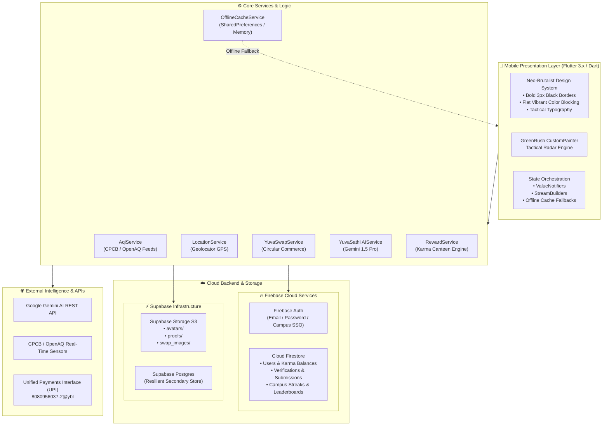
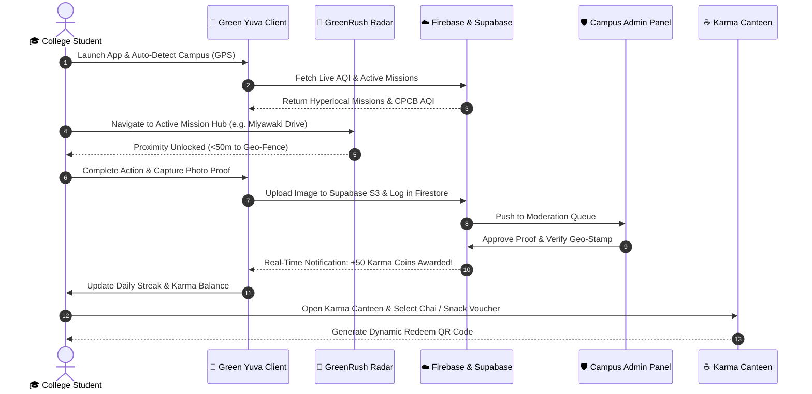

# 🌱 Green Yuva (ग्रीन युवा)
### *Youth-Led Climate Action & Campus Decarbonization Ecosystem*

<p align="center">
  
</p>

<p align="center">
  <a href="https://flutter.dev"></a>
  <a href="https://dart.dev"></a>
  <a href="https://firebase.google.com"></a>
  <a href="https://supabase.com"></a>
  <a href="https://ai.google.dev"></a>
  <a href="https://cpcb.nic.in"></a>
  <a href="LICENSE"></a>
</p>

---

## 📌 Table of Contents
- [🌍 Vision & The Problem](#-vision--the-problem)
- [✨ Core Innovation Pillars](#-core-innovation-pillars)
- [🏛️ System Architecture](#️-system-architecture)
- [🔄 User Journey & Action Workflow](#-user-journey--action-workflow)
- [📱 Mobile App Showcase (15 Live Screens)](#-mobile-app-showcase)
- [🛠️ Technology Stack](#️-technology-stack)
- [🔐 Backend, Security & Cloud Architecture](#-backend-security--cloud-architecture)
- [🚀 Installation & Getting Started](#-installation--getting-started)
- [🗺️ Campus Decarbonization Roadmap](#️-campus-decarbonization-roadmap)
- [👨‍💻 Author & Acknowledgements](#-author--acknowledgements)

---

## 🌍 Vision & The Problem

Across India's **40,000+ higher education institutions**, millions of students inhabit micro-cities that consume massive amounts of energy, generate metric tons of single-use waste, and face severe urban air quality hazards ($PM_{2.5}$ and $PM_{10}$).

While youth desire to participate in ecological stewardship, traditional climate initiatives suffer from three fatal friction points:
1. **The Intangibility Deficit**: Students cannot observe the localized, verifiable carbon impact of their daily choices.
2. **Missing Hyperlocal Incentives**: Eco-actions are treated as volunteer chores without gamified feedback, peer competition, or tangible campus utility.
3. **Linear Campus Consumption**: Textbooks, drafters, calculators, and lab gear are discarded at the end of each academic semester instead of circulating within the campus economy.

### 💡 The Green Yuva Solution
**Green Yuva** is a high-octane, gamified campus climate ecosystem engineered with a **Neo-Brutalist design language**. It bridges real-world physical eco-actions with digital verification, tokenized **Karma Coins**, live **Central Pollution Control Board (CPCB)** air monitoring, an **offline-first tactical campus radar (GreenRush)**, a circular student marketplace (**YuvaSwap**), and an on-device AI climate tutor (**YuvaSathi AI**).

```
   [ Real-World Student Eco Action ] 
                 ↓
  [ Geo-Fenced Proximity & Photo Proof ] 
                 ↓
  [ Dual-Engine Cloud Verification (Firebase + Supabase) ]
                 ↓
  [ Karma Coins & Campus Streak Accrual ] 
                 ↓
  [ Campus Canteen Perks & YuvaSwap Circular Commerce ]
```

---

## ✨ Core Innovation Pillars

### 1. ⚡ GreenRush — Tactical Campus Eco-Radar
* **Hyperlocal GPS Geo-Fencing**: Interactive radar view pinpointing active campus decarbonization hubs (e.g., PCCOE, COEP, VIT, solar microgrids, compost facilities, Miyawaki forests).
* **Live Distance & Proximity Locking**: Missions unlock only when students are physically within the verified campus perimeter.
* **Camera Proof Verification**: Real-time snapshot submission with auto-queued offline upload resilience.

### 2. 🔄 YuvaSwap — Circular Campus Marketplace
* **Zero-Waste Student Economy**: Buy, sell, or donate pre-owned engineering drawing drafters, scientific calculators, lab aprons, and semester textbooks.
* **CO₂ & Landfill Diverted Metrics**: Every completed transaction computes kilograms of paper and carbon emissions diverted from urban landfills.
* **Direct In-App Chat & Safety**: Verified student-to-student exchange with campus meeting zones.

### 3. 📊 YuvaSense — Real-Time Indian Environmental Intelligence
* **Live CPCB India & OpenAQ Integration**: Real-time monitoring of $PM_{2.5}$, $PM_{10}$, $NO_2$, $SO_2$, and composite AQI for Indian metropolitan and tier-2 college hubs.
* **IMD Disaster Weather Warning Bulletins**: Early-warning alerts for Western Disturbances, flash floods, heatwaves, and seasonal smog spikes.
* **India Action Case Studies**: Curated deep-dives on national benchmarks—Rewa Ultra Mega Solar (MP), Indore Asia's Largest Bio-CNG Plant, and Sikkim's 100% Organic Farming Revolution.
* **Gamified Climate Quizzes**: Rapid-fire trivia modules covering Renewable Energy, SDG 13, Carbon Offsets, and Waste Segregation.

### 4. 🤖 YuvaSathi AI — Personalized Campus Eco-Tutor
* **Powered by Google Gemini 1.5 Pro**: Multimodal intelligence fine-tuned for college zero-waste living, recycling categorization, and carbon calculations.
* **Context-Aware Suggestions**: Recommends personalized campus missions based on the student's branch, hostel location, and daily commute pattern.

### 5. 🪙 Karma Canteen & Dual-Token Economy
* **Tangible Utility for Climate Action**: Students redeem earned Karma Coins for campus canteen meals, library fine waivers, cafeteria beverages, and student giveaways.
* **Daily Streak Multipliers**: Promotes sustained habit formation with milestone badges and university leaderboard rankings.

---

## 🏛️ System Architecture



---

## 🔄 User Journey & Action Workflow



---

## 📱 Mobile App Showcase

Every screen in Green Yuva has been crafted with a distinctive **Neo-Brutalist UI**—featuring bold high-contrast strokes, vivid primary cards, tactile depth, and instant responsiveness.

### 🌟 Part 1: Home Dashboard, Live Notifications & Module Hubs
| 01. Home Dashboard & AQI | 02. Real-time Notifications | 03. Green Yuva Hubs |
| :---: | :---: | :---: |
|  |  |  |
| *Live CPCB AQI, active streak counter, Karma Coins display, and instant Canteen shortcuts.* | *Push alerts for verification approvals, university giveaways, and streak reminders.* | *Full navigation hub: YuvaSwap, GreenRush Radar, YuvaSense, and YuvaVibe.* |

---

### 🌟 Part 2: Campus Community, College Hubs & YuvaSwap
| 04. Community Actions | 05. YuvaVibe College Hubs | 06. YuvaSwap Marketplace |
| :---: | :---: | :---: |
|  |  |  |
| *Miyawaki afforestation, hostel compost drives, and solar audit community initiatives.* | *Pune regional engineering hubs: PCCOE, COEP Tech, and VIT Pune leaderboards.* | *Circular student exchange: Pre-owned gear, calculated CO₂ and landfill diversion.* |

---

### 🌟 Part 3: Swap Listings, GreenRush Radar & Live CPCB AQI
| 07. Post Swap Item | 08. GreenRush Tactical Radar | 09. YuvaSense CPCB AQI |
| :---: | :---: | :---: |
|  |  |  |
| *Publish textbooks, lab coats, and drafters with instant condition badges and pricing.* | *Neo-Brutalist GPS radar scanning campus missions with dynamic compass orientation.* | *Live Central Pollution Control Board telemetry: PM2.5, PM10, and health warnings.* |

---

### 🌟 Part 4: Interactive Quizzes, Disaster Bulletins & Indian Case Studies
| 10. Climate Quizzes | 11. IMD Disaster Tracker | 12. Indian Benchmark Cases |
| :---: | :---: | :---: |
|  |  |  |
| *Engaging climate challenges on carbon footprints, SDG 13, and solar photovoltaics.* | *Real-time IMD alert bulletins for Western Disturbances and smog flash-points.* | *National benchmarks: Rewa Solar Park, Indore Bio-CNG, and Sikkim 100% Organic.* |

---

### 🌟 Part 5: AI Climate Tutor, Campus Sprint & User Profile
| 13. YuvaSathi AI Tutor | 14. Campus Activities Sprint | 15. User Profile & Karma History |
| :---: | :---: | :---: |
|  |  |  |
| *Intelligent conversational assistant for campus zero-waste tips and project guidance.* | *PCCOE Pawana River Desilting Drive and Campus Solar Microgrid Audit tracks.* | *Eco Campus Champion rank, 100 Karma Coins, badges, and complete action ledger.* |

---

## 🛠️ Technology Stack

| Domain | Technology / Framework | Usage in Green Yuva |
| :--- | :--- | :--- |
| **Frontend Mobile** | **Flutter 3.x / Dart 3.x** | Cross-platform Android & iOS codebase with hot reload |
| **UI Paradigm** | **Neo-Brutalism Design** | High-contrast borders, solid offsets, vibrant flat colors, tactile cards |
| **Authentication** | **Firebase Auth** | Campus email authentication, session management, secure tokens |
| **Primary Database** | **Cloud Firestore** | Real-time reactive data for users, missions, verifications, and feeds |
| **Asset Storage** | **Supabase Storage S3** | High-throughput distributed storage for avatars, proofs, swap_images |
| **Artificial Intelligence** | **Google Gemini 1.5 Pro** | Contextual climate conversational tutor (YuvaSathi AI) |
| **Telemetry & AQI** | **CPCB India & OpenAQ** | Real-time pollution sensor data (PM2.5, PM10, AQI) |
| **Geospatial & GPS** | **Geolocator & Google Maps** | Hyperlocal campus geo-fences, distance calculation, radar coordinates |
| **Local Cache & Offline** | **SharedPreferences & Memory Cache** | Full offline resilience for low-connectivity university zones |
| **Payments & P2P** | **UPI QR Protocol** | Direct UPI deep-linking for campus rewards and student swaps |

---

## 🔐 Backend, Security & Cloud Architecture

### Multi-Cloud Redundancy
Green Yuva employs a **hybrid dual-engine cloud architecture**:
1. **Firebase Cloud Firestore**: Manages real-time data sync, user authentication, streak counters, and admin verification workflows with sub-second latency.
2. **Supabase S3 Storage**: Handles media ingestion (proof pictures, marketplace photos, user avatars) across three dedicated buckets (`avatars`, `proofs`, `swap_images`).
3. **Graceful Offline Degradation**: When a student enters a campus basement, lab, or low-connectivity area, the `OfflineCacheService` transparently serves cached missions, quizzes, and telemetry while queueing submissions in an on-device sync pipeline.

### Cloud Firestore Security Rules
Production-hardened security rules ensure that users can only modify their own profile data, while verification reviews are strictly reserved for campus administrators:

```javascript
rules_version = '2';
service cloud.firestore {
  match /databases/{database}/documents {
    match /users/{userId} {
      allow read: if request.auth != null;
      allow write: if request.auth != null && request.auth.uid == userId;
    }
    match /verifications/{docId} {
      allow read: if request.auth != null;
      allow create: if request.auth != null;
      allow update, delete: if request.auth != null && 
        get(/databases/$(database)/documents/users/$(request.auth.uid)).data.role == 'admin';
    }
    match /swap_items/{itemId} {
      allow read: if request.auth != null;
      allow create: if request.auth != null;
      allow update, delete: if request.auth != null && 
        resource.data.sellerId == request.auth.uid;
    }
  }
}
```

---

## 🚀 Installation & Getting Started

### Prerequisites
* **Flutter SDK**: `>=3.19.0`
* **Dart SDK**: `>=3.3.0`
* **Android Studio / VS Code** with Flutter extensions installed
* An active **Firebase Project** (`google-services.json` configured)
* An active **Supabase Project** with buckets: `avatars`, `proofs`, `swap_images`

### 1. Clone the Repository
```bash
git clone https://github.com/madhavzanwar/green-yuva.git
cd green-yuva
```

### 2. Install Dependencies
```bash
flutter pub get
```

### 3. Configure Environment Credentials
Create a `.env` file in the root directory (or inject via `--dart-define`):
```env
SUPABASE_URL=https://your-project.supabase.co
SUPABASE_ANON_KEY=your-supabase-anon-key
GEMINI_API_KEY=your-google-gemini-api-key
```

### 4. Run Static Analysis & Verification
```bash
dart analyze lib
```

### 5. Launch Application
```bash
# Debug run on connected Android device or emulator
flutter run

# Build release APK
flutter build apk --release
```

---

## 🗺️ Campus Decarbonization Roadmap

- [x] **Phase 1: Foundation & Identity** — Complete Neo-Brutalist design overhaul, Green Yuva brand identity, and multi-cloud sync.
- [x] **Phase 2: Hyperlocal GreenRush Radar** — GPS-enabled tactical radar with geo-fenced campus mission hubs.
- [x] **Phase 3: YuvaSwap Circular Marketplace** — Student-to-student exchange with automated CO2 savings algorithms.
- [x] **Phase 4: YuvaSense & Real-Time CPCB AQI** — Central Pollution Control Board live telemetry and IMD disaster warnings.
- [x] **Phase 5: Karma Canteen & UPI Tokenomics** — Real-world perks redeemable at college cafeterias.
- [ ] **Phase 6: Multi-University Inter-Campus League** — State-level leaderboards comparing carbon offsets between institutions.
- [ ] **Phase 7: IoT Smart Bin Integration** — NFC/QR-enabled smart waste bins that instantly dispense Karma Coins upon e-waste disposal.

---

## 👨‍💻 Author & Acknowledgements

**Green Yuva** is envisioned and engineered by:
* **Madhav Zanwar** — *Lead Developer & Climate Tech Enthusiast*
* **GitHub**: [@madhavzanwar](https://github.com/madhavzanwar)
* **Target Repository**: [github.com/madhavzanwar/green-yuva](https://github.com/madhavzanwar/green-yuva)

### 🙏 Acknowledgements
* **Central Pollution Control Board (CPCB) & OpenAQ** for open environmental telemetry feeds.
* **Google Gemini** for powering conversational sustainability intelligence.
* **The Indian Youth & Campus Green Chapters** leading real-world decarbonization across the nation.

---

<p align="center">
  <b>Built with 💚 for India's Youth & A Sustainable Tomorrow.</b><br/>
  <sub>© 2026 Green Yuva Team — Madhav Zanwar. Released under the MIT License.</sub>
</p>
